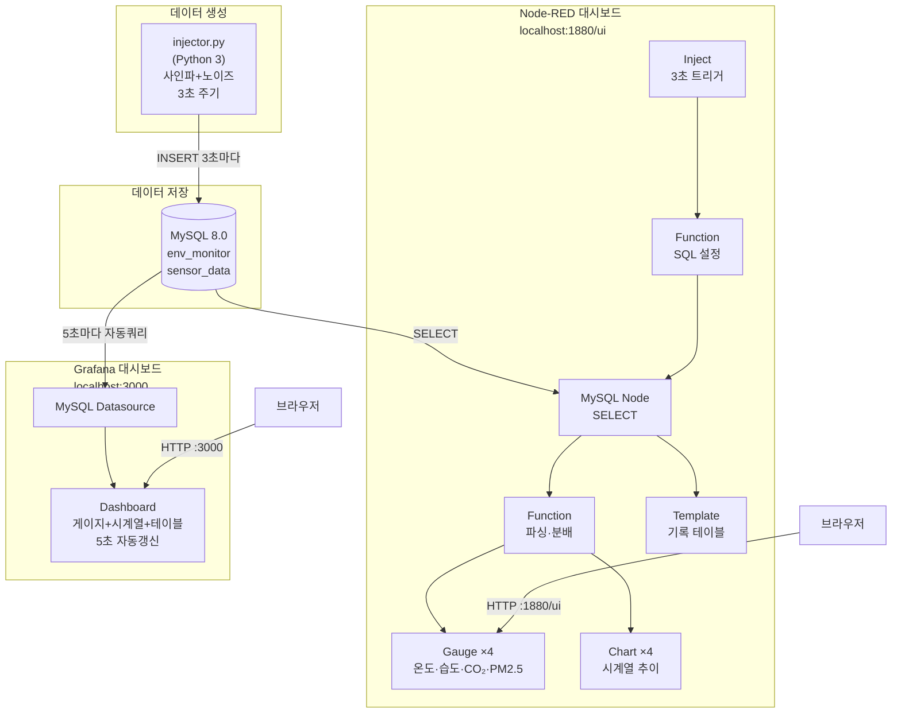
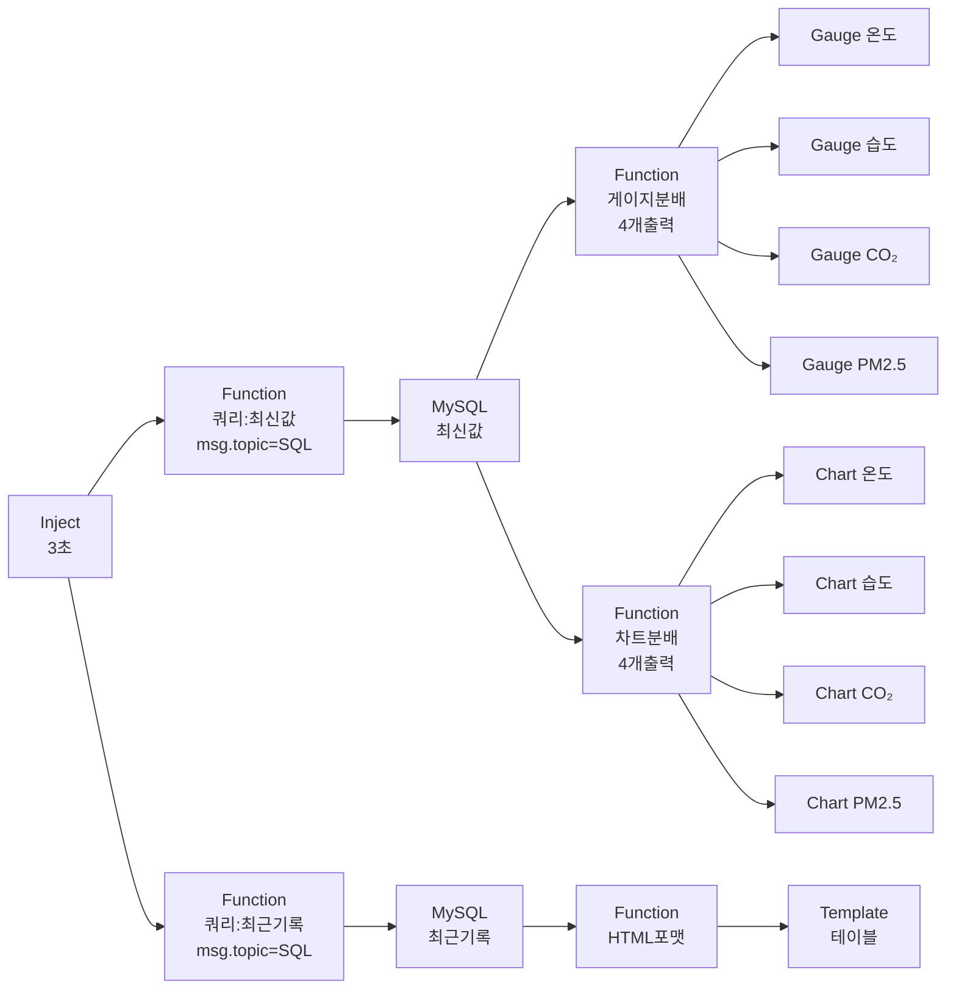

# IoT 실시간 모니터링 — Node-RED & Grafana

MySQL에 저장된 IoT 환경 센서 데이터를 **Node-RED**와 **Grafana** 두 가지 대시보드로 실시간 시각화하는 시스템입니다.

---

## 1. 프로젝트 개요

| 구성 요소 | 역할 |
|-----------|------|
| `injector.py` | Python — 3초마다 가상 센서 데이터 생성 → MySQL INSERT |
| MySQL | 시계열 센서 데이터 저장소 (`env_monitor.sensor_data`) |
| **Node-RED** | 플로우 기반 실시간 게이지·차트 대시보드 (port 1880) |
| **Grafana** | 전문 시계열 모니터링 대시보드 (port 3000) |

---

## 2. 전체 시스템 블록도



---

## 3. Node-RED 플로우 구조



---

## 4. 데이터베이스 스키마

| 컬럼 | 타입 | 설명 |
|------|------|------|
| `id` | INT AUTO_INCREMENT PK | 고유 식별자 |
| `location` | VARCHAR(50) | 측정 위치 (실험실/사무실/서버실/야외) |
| `temperature` | DECIMAL(5,2) | 온도 °C |
| `humidity` | DECIMAL(5,2) | 습도 % |
| `co2` | INT | CO₂ ppm |
| `pm25` | DECIMAL(6,2) | PM2.5 µg/m³ |
| `recorded_at` | TIMESTAMP | 기록 시각 |

---

## 5. 파일 구조

```
iot-nodered-grafana/
├── injector.py              # Python 센서 데이터 생성기
├── nodered/
│   └── flows.json           # Node-RED 플로우 정의
├── grafana/
│   ├── datasource.yaml      # MySQL 데이터소스 프로비저닝
│   ├── dashboard-provisioning.yaml
│   └── dashboard.json       # Grafana 대시보드 정의
├── setup.sh                 # 자동 설치 스크립트
├── process.md               # 이 파일 (Mermaid 블록도 포함)
└── README.md                # 사용 설명서
```

---

## 6. 실행 방법

### 1단계: 설치
```bash
sudo bash setup.sh
```

### 2단계: 데이터 주입
```bash
python3 injector.py
```

### 3단계: Node-RED 시작
```bash
node-red --port 1880
# → http://localhost:1880/ui
```

### 4단계: Grafana 시작
```bash
~/grafana-standalone/bin/grafana server \
  --config ~/grafana-standalone/conf/custom.ini \
  --homepath ~/grafana-standalone
# → http://localhost:3000  (admin / admin)
```
